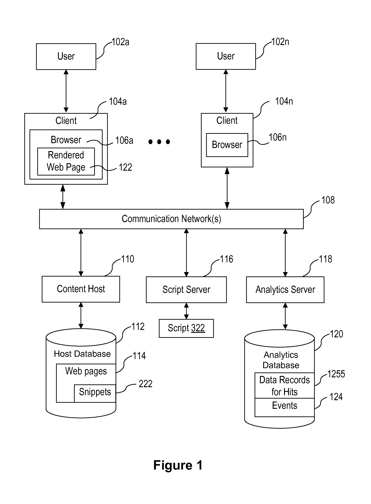

## 분석툴 사용 시의 유의 사항

제가 B2B SaaS나 일부 회사의 Google Analytics4 이벤트 설계 및 설치, 대시보드 구축을 진행할 때, 대표님들이 주로 생각하는 것들이 있습니다. 물론, 실제로 말하진 않지만 대체로 느껴지는 사항은 아래와 같습니다.

> **GA4를 설치했으니까, 이제 매출이 더 오를 수 있겠지?**
>
> **GA4를 설치했으니까, 사람들이 왜 이런 행동을 하는지 알 수 있겠지?**

하지만 이 부분은 제가 단언할 수 있습니다. 위 내용은 절대 일어나지 않습니다.

## 분석툴은 마법봉이 아닙니다.

분석툴은 매출을 높이거나, 문제를 해결하기 위한 하나의 수단일 뿐입니다. 여러 수단 중 하나가 도움을 줄 수는 있지만, 특효약처럼 목적을 이뤄주지는 않습니다. 분석툴을 도입하는 것만으로 마법 같이 유저의 행동 이유를 파악할 수 있다거나, 매출을 비약적으로 올릴 수 있는 것은 없습니다. 모든 과정은 추론과 가정, 실행과 결과로 확인하고 개선하는 방법 밖에 없습니다.

듣는 사람의 입장에서는 아쉬운 말이지만, 어쩔 수 없는 현실입니다. 다시 한 번 말씀드리자면 분석툴을 도입하는 것만으로 우리가 바라는 목적을 이룰 수는 없습니다.

---

## Google Analytics4는 어떻게 작동하는 걸까요?

> 해당 내용은 알면 좋겠지만, 반드시 알 필요는 없습니다.\
> 다만, 추후 Google 태그 게이트웨이 설정 이유를 이해하는데 도움이 될 수 있습니다.

비단 Google Analytics4 뿐만 아니라, 대부분의 분석툴의 작동 방식은 유사합니다. 분석툴은 우리 사이트 `<head>` 안에 스크립트 코드를 삽입하도록 합니다. 그러고 나면 마법같이 우리 사이트에서 발생하는 데이터가 분석툴에서 나타나게 됩니다.

그렇다면 어떻게 스크립트 하나만 설치해도 이런 일들이 생기는 걸까요? 우리가 설치하는 `gtag.js` 를 설치하면 Google 서버에서 데이터 수집을 위한 코드를 가져오게 됩니다. 해당 코드는 브라우저의 API를 활용해서 데이터를 수집하고, Google 서버로 전송하게 됩니다.

아래 이미지는 그 흐름에 대한 구글의 특허 자료 중 하나입니다. 물론, 해당 특허는 [비동기 스크립트 로딩](https://patents.google.com/patent/US8713424B1/en)에 대한 내용입니다. 그래도 해당 이미지를 통해서 스크립트가 어떻게 작동하는지 파악할 수 있습니다.

간단히 보자면 유저가 브라우저에 접속하면, Content Host(110)에서 웹사이트 콘텐츠 `html` `css` 등을 제공합니다. 이 때 우리가 설치한 `gtag.js`가 같이 전송됩니다. 이후 브라우저가 Snippet (222)를 읽으면, Script Server (116)에서 데이터 수집을 위한 Script (322) 를 다운로드 하게 됩니다. 이후 브라우저가 수집한 사용자 데이터를 Analytics Server (118)에 전달하게 됩니다.

해당 과정은 Github를 사용해서 스크립트 코드를 만들고 사용해보면 이해가 쉽습니다. 하지만 이러한  일련의 과정을 반드시 이해할 필요는 없으니, 이러한 내용을 이해하는 것은 선택 사항입니다.&#x20;
